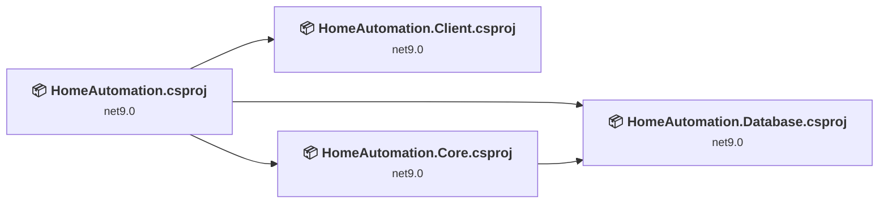
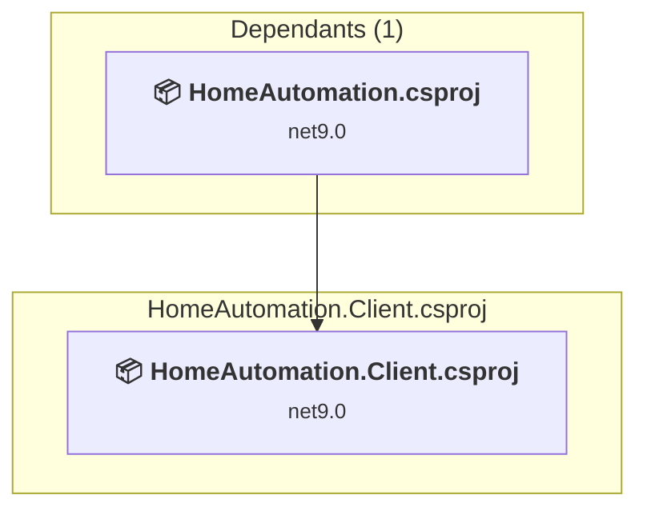
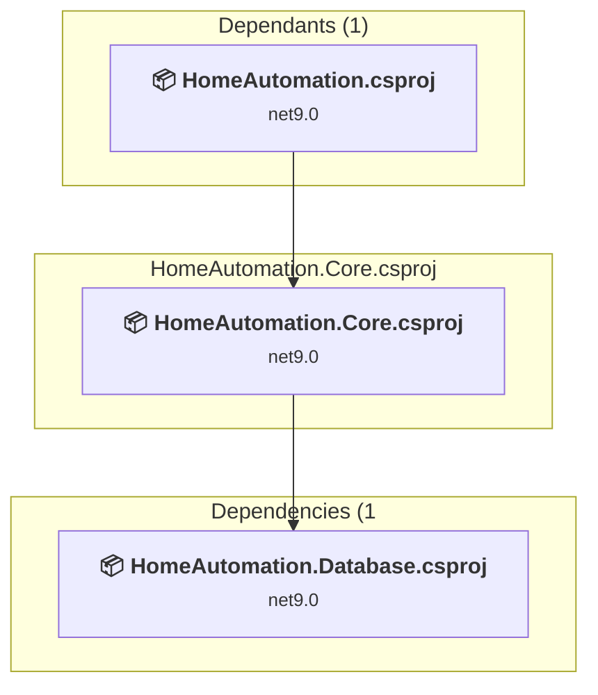
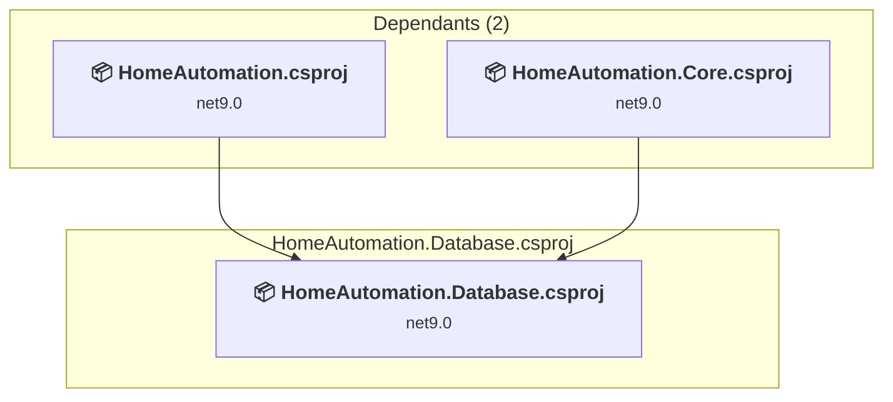
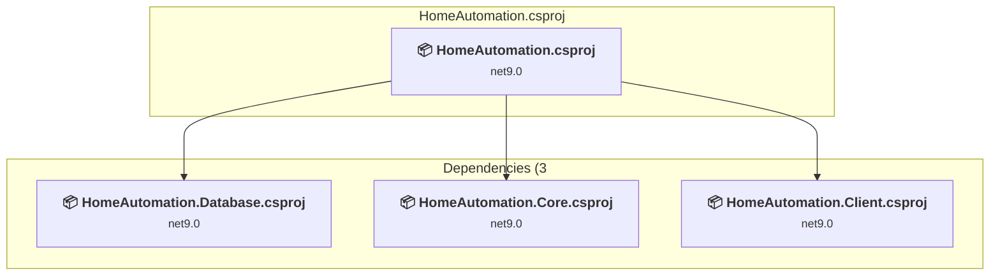

# Projects and dependencies analysis

This document provides a comprehensive overview of the projects and their dependencies in the context of upgrading to .NETCoreApp,Version=v10.0.

## Table of Contents

- [Executive Summary](#executive-Summary)
  - [Highlevel Metrics](#highlevel-metrics)
  - [Projects Compatibility](#projects-compatibility)
  - [Package Compatibility](#package-compatibility)
  - [API Compatibility](#api-compatibility)
- [Aggregate NuGet packages details](#aggregate-nuget-packages-details)
- [Top API Migration Challenges](#top-api-migration-challenges)
  - [Technologies and Features](#technologies-and-features)
  - [Most Frequent API Issues](#most-frequent-api-issues)
- [Projects Relationship Graph](#projects-relationship-graph)
- [Project Details](#project-details)

  - [HomeAutomation.Client\HomeAutomation.Client.csproj](#homeautomationclienthomeautomationclientcsproj)
  - [HomeAutomation.Core\HomeAutomation.Core.csproj](#homeautomationcorehomeautomationcorecsproj)
  - [HomeAutomation.Database\HomeAutomation.Database.csproj](#homeautomationdatabasehomeautomationdatabasecsproj)
  - [HomeAutomation\HomeAutomation.csproj](#homeautomationhomeautomationcsproj)

## Executive Summary

### Highlevel Metrics

| Metric | Count | Status |
| :--- | :---: | :--- |
| Total Projects | 4 | All require upgrade |
| Total NuGet Packages | 14 | 9 need upgrade |
| Total Code Files | 110 |  |
| Total Code Files with Incidents | 13 |  |
| Total Lines of Code | 8050 |  |
| Total Number of Issues | 41 |  |
| Estimated LOC to modify | 27+ | at least 0,3% of codebase |

### Projects Compatibility

| Project | Target Framework | Difficulty | Package Issues | API Issues | Est. LOC Impact | Description |
| :--- | :---: | :---: | :---: | :---: | :---: | :--- |
| [HomeAutomation.Client\HomeAutomation.Client.csproj](#homeautomationclienthomeautomationclientcsproj) | net9.0 | 🟢 Low | 1 | 0 |  | AspNetCore, Sdk Style = True |
| [HomeAutomation.Core\HomeAutomation.Core.csproj](#homeautomationcorehomeautomationcorecsproj) | net9.0 | 🟢 Low | 6 | 25 | 25+ | ClassLibrary, Sdk Style = True |
| [HomeAutomation.Database\HomeAutomation.Database.csproj](#homeautomationdatabasehomeautomationdatabasecsproj) | net9.0 | 🟢 Low | 1 | 0 |  | ClassLibrary, Sdk Style = True |
| [HomeAutomation\HomeAutomation.csproj](#homeautomationhomeautomationcsproj) | net9.0 | 🟢 Low | 2 | 2 | 2+ | AspNetCore, Sdk Style = True |

### Package Compatibility

| Status | Count | Percentage |
| :--- | :---: | :---: |
| ✅ Compatible | 5 | 35,7% |
| ⚠️ Incompatible | 0 | 0,0% |
| 🔄 Upgrade Recommended | 9 | 64,3% |
| ***Total NuGet Packages*** | ***14*** | ***100%*** |

### API Compatibility

| Category | Count | Impact |
| :--- | :---: | :--- |
| 🔴 Binary Incompatible | 3 | High - Require code changes |
| 🟡 Source Incompatible | 8 | Medium - Needs re-compilation and potential conflicting API error fixing |
| 🔵 Behavioral change | 16 | Low - Behavioral changes that may require testing at runtime |
| ✅ Compatible | 13018 |  |
| ***Total APIs Analyzed*** | ***13045*** |  |

## Aggregate NuGet packages details

| Package | Current Version | Suggested Version | Projects | Description |
| :--- | :---: | :---: | :--- | :--- |
| Microsoft.AspNetCore.Components.WebAssembly | 9.0.8 | 10.0.5 | [HomeAutomation.Client.csproj](#homeautomationclienthomeautomationclientcsproj) | NuGet package upgrade is recommended |
| Microsoft.AspNetCore.Components.WebAssembly.Server | 9.0.8 | 10.0.5 | [HomeAutomation.csproj](#homeautomationhomeautomationcsproj) | NuGet package upgrade is recommended |
| Microsoft.EntityFrameworkCore.Design | 9.0.8 | 10.0.5 | [HomeAutomation.csproj](#homeautomationhomeautomationcsproj) | NuGet package upgrade is recommended |
| Microsoft.Extensions.Configuration.Abstractions | 9.0.8 | 10.0.5 | [HomeAutomation.Core.csproj](#homeautomationcorehomeautomationcorecsproj) | NuGet package upgrade is recommended |
| Microsoft.Extensions.Configuration.Binder | 9.0.8 | 10.0.5 | [HomeAutomation.Core.csproj](#homeautomationcorehomeautomationcorecsproj) | NuGet package upgrade is recommended |
| Microsoft.Extensions.Hosting.Abstractions | 9.0.8 | 10.0.5 | [HomeAutomation.Core.csproj](#homeautomationcorehomeautomationcorecsproj) [HomeAutomation.Database.csproj](#homeautomationdatabasehomeautomationdatabasecsproj) | NuGet package upgrade is recommended |
| Microsoft.Extensions.Http | 9.0.8 | 10.0.5 | [HomeAutomation.Core.csproj](#homeautomationcorehomeautomationcorecsproj) | NuGet package upgrade is recommended |
| Microsoft.Extensions.Logging.Abstractions | 9.0.8 | 10.0.5 | [HomeAutomation.Core.csproj](#homeautomationcorehomeautomationcorecsproj) | NuGet package upgrade is recommended |
| MimeKit | 4.13.0 | 4.15.1 | [HomeAutomation.Core.csproj](#homeautomationcorehomeautomationcorecsproj) | NuGet package contains security vulnerability |
| MudBlazor | 8.11.0 |  | [HomeAutomation.csproj](#homeautomationhomeautomationcsproj) | ✅Compatible |
| Npgsql.EntityFrameworkCore.PostgreSQL | 9.0.4 |  | [HomeAutomation.Database.csproj](#homeautomationdatabasehomeautomationdatabasecsproj) | ✅Compatible |
| SlackNet | 0.17.3 |  | [HomeAutomation.Core.csproj](#homeautomationcorehomeautomationcorecsproj) | ✅Compatible |
| SlackNet.Extensions.DependencyInjection | 0.17.3 |  | [HomeAutomation.Core.csproj](#homeautomationcorehomeautomationcorecsproj) | ✅Compatible |
| SmtpServer | 11.0.0 |  | [HomeAutomation.Core.csproj](#homeautomationcorehomeautomationcorecsproj) | ✅Compatible |

## Top API Migration Challenges

### Technologies and Features

| Technology | Issues | Percentage | Migration Path |
| :--- | :---: | :---: | :--- |

### Most Frequent API Issues

| API | Count | Percentage | Category |
| :--- | :---: | :---: | :--- |
| T:System.Net.Http.HttpContent | 11 | 40,7% | Behavioral Change |
| M:System.TimeSpan.FromHours(System.Double) | 6 | 22,2% | Source Incompatible |
| M:System.TimeSpan.FromSeconds(System.Int64) | 2 | 7,4% | Source Incompatible |
| T:System.Uri | 2 | 7,4% | Behavioral Change |
| M:Microsoft.Extensions.Configuration.ConfigurationBinder.Get''1(Microsoft.Extensions.Configuration.IConfiguration) | 2 | 7,4% | Binary Incompatible |
| M:System.Uri.#ctor(System.String) | 1 | 3,7% | Behavioral Change |
| M:Microsoft.Extensions.Configuration.ConfigurationBinder.GetValue''1(Microsoft.Extensions.Configuration.IConfiguration,System.String) | 1 | 3,7% | Binary Incompatible |
| M:Microsoft.AspNetCore.Builder.ExceptionHandlerExtensions.UseExceptionHandler(Microsoft.AspNetCore.Builder.IApplicationBuilder,System.String,System.Boolean) | 1 | 3,7% | Behavioral Change |
| M:Microsoft.Extensions.DependencyInjection.HttpClientFactoryServiceCollectionExtensions.AddHttpClient(Microsoft.Extensions.DependencyInjection.IServiceCollection) | 1 | 3,7% | Behavioral Change |

## Projects Relationship Graph

Legend:
📦 SDK-style project
⚙️ Classic project

## Project Details

### HomeAutomation.Client\HomeAutomation.Client.csproj

#### Project Info

- **Current Target Framework:** net9.0
- **Proposed Target Framework:** net10.0
- **SDK-style**: True
- **Project Kind:** AspNetCore
- **Dependencies**: 0
- **Dependants**: 1
- **Number of Files**: 4
- **Number of Files with Incidents**: 1
- **Lines of Code**: 5
- **Estimated LOC to modify**: 0+ (at least 0,0% of the project)

#### Dependency Graph

Legend:
📦 SDK-style project
⚙️ Classic project

### API Compatibility

| Category | Count | Impact |
| :--- | :---: | :--- |
| 🔴 Binary Incompatible | 0 | High - Require code changes |
| 🟡 Source Incompatible | 0 | Medium - Needs re-compilation and potential conflicting API error fixing |
| 🔵 Behavioral change | 0 | Low - Behavioral changes that may require testing at runtime |
| ✅ Compatible | 9 |  |
| ***Total APIs Analyzed*** | ***9*** |  |

### HomeAutomation.Core\HomeAutomation.Core.csproj

#### Project Info

- **Current Target Framework:** net9.0
- **Proposed Target Framework:** net10.0
- **SDK-style**: True
- **Project Kind:** ClassLibrary
- **Dependencies**: 1
- **Dependants**: 1
- **Number of Files**: 45
- **Number of Files with Incidents**: 9
- **Lines of Code**: 2590
- **Estimated LOC to modify**: 25+ (at least 1,0% of the project)

#### Dependency Graph

Legend:
📦 SDK-style project
⚙️ Classic project

### API Compatibility

| Category | Count | Impact |
| :--- | :---: | :--- |
| 🔴 Binary Incompatible | 3 | High - Require code changes |
| 🟡 Source Incompatible | 8 | Medium - Needs re-compilation and potential conflicting API error fixing |
| 🔵 Behavioral change | 14 | Low - Behavioral changes that may require testing at runtime |
| ✅ Compatible | 2537 |  |
| ***Total APIs Analyzed*** | ***2562*** |  |

### HomeAutomation.Database\HomeAutomation.Database.csproj

#### Project Info

- **Current Target Framework:** net9.0
- **Proposed Target Framework:** net10.0
- **SDK-style**: True
- **Project Kind:** ClassLibrary
- **Dependencies**: 0
- **Dependants**: 2
- **Number of Files**: 45
- **Number of Files with Incidents**: 1
- **Lines of Code**: 4918
- **Estimated LOC to modify**: 0+ (at least 0,0% of the project)

#### Dependency Graph

Legend:
📦 SDK-style project
⚙️ Classic project

### API Compatibility

| Category | Count | Impact |
| :--- | :---: | :--- |
| 🔴 Binary Incompatible | 0 | High - Require code changes |
| 🟡 Source Incompatible | 0 | Medium - Needs re-compilation and potential conflicting API error fixing |
| 🔵 Behavioral change | 0 | Low - Behavioral changes that may require testing at runtime |
| ✅ Compatible | 6494 |  |
| ***Total APIs Analyzed*** | ***6494*** |  |

### HomeAutomation\HomeAutomation.csproj

#### Project Info

- **Current Target Framework:** net9.0
- **Proposed Target Framework:** net10.0
- **SDK-style**: True
- **Project Kind:** AspNetCore
- **Dependencies**: 3
- **Dependants**: 0
- **Number of Files**: 42
- **Number of Files with Incidents**: 2
- **Lines of Code**: 537
- **Estimated LOC to modify**: 2+ (at least 0,4% of the project)

#### Dependency Graph

Legend:
📦 SDK-style project
⚙️ Classic project

### API Compatibility

| Category | Count | Impact |
| :--- | :---: | :--- |
| 🔴 Binary Incompatible | 0 | High - Require code changes |
| 🟡 Source Incompatible | 0 | Medium - Needs re-compilation and potential conflicting API error fixing |
| 🔵 Behavioral change | 2 | Low - Behavioral changes that may require testing at runtime |
| ✅ Compatible | 3978 |  |
| ***Total APIs Analyzed*** | ***3980*** |  |

